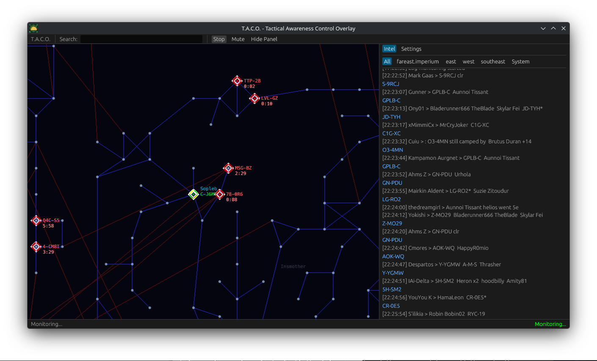
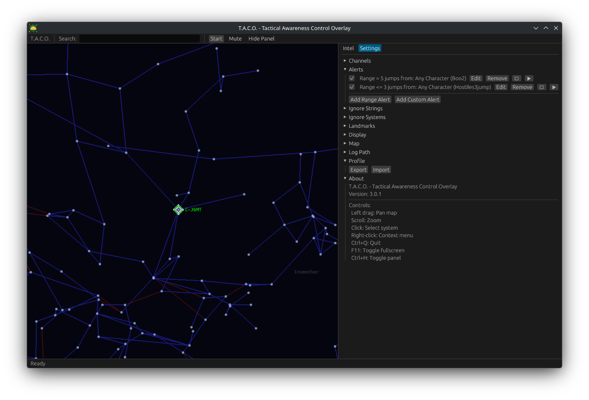

# T.A.C.O. - Tactical Awareness Control Overlay

[](https://github.com/sopleb/TACO-Rusty/actions/workflows/release.yml)
[](https://github.com/sopleb/TACO-Rusty/releases/latest)
[](https://github.com/sopleb/TACO-Rusty/releases)

An intel overlay for EVE Online that monitors chat logs and displays real-time threat alerts on a 3D star map.




## Download

Grab the latest build from [Releases](https://github.com/sopleb/TACO-Rusty/releases/latest).

| Platform | Package |
|----------|---------|
| Windows | `.zip` |
| macOS (Universal) | `.tar.gz` |
| Linux | `.tar.gz`, `.AppImage`, `.deb`, `.rpm`, `.pkg.tar.gz`, `.flatpak` |

## Features

- 3D/2D interactive star map with system connections
- Real-time intel monitoring from EVE chat logs
- Configurable range-based and keyword alert triggers with sound notifications
- Alert popup notifications (system notifications on Linux, overlay window on Windows/macOS)
- Preset alert templates for quick setup (in-system, 3-jump, 5-jump)
- Multi-character tracking with automatic system detection
- Home system, landmarks, and monitored system highlighting
- Right-click context menu for system actions (ignore, highlight, set home)
- Follow characters across the map
- Color legend overlay on the map (Home/Alert/Character)
- Toast notifications for key actions
- System info on hover (name + region) and home/character status bar
- Message counts on intel tabs and config section headers
- Tooltips on config options for new users
- Confirmation dialogs for destructive actions
- Auto-update checker with link to latest release
- Profile export/import
- Dark mode
- Cross-platform: Windows, macOS, Linux (X11 + Wayland)

## Usage

1. Launch the app
2. Set your home system by searching for it or right-clicking a system on the map
3. Click **Start** to begin monitoring EVE chat logs
4. Add intel channels in **Settings > Channels** (e.g. name: `Standing Fleet`, prefix: `standing`)
5. Configure alert triggers in **Settings > Alerts**

### Controls

| Input | Action |
|-------|--------|
| Left drag | Pan map |
| Scroll | Zoom |
| Click | Select system |
| Right-click | Context menu |
| Ctrl+F | Focus search (Cmd+F on macOS) |
| Home | Refocus map on home/characters |
| Ctrl+Q | Quit (Cmd+Q on macOS) |
| F11 | Toggle fullscreen (Ctrl+F11 on macOS) |
| Ctrl+H | Toggle panel (Cmd+H on macOS) |

## Building from Source

Requires [Rust](https://rustup.rs/) 1.75+.

```bash
# Generate EVE SDE data (required on first build)
cargo run --release --bin sde_convert

# Build
cargo build --release
```

The binary will be at `target/release/taco` (or `taco.exe` on Windows).

### Linux Dependencies

```bash
# Debian/Ubuntu
sudo apt install libgl-dev libxkbcommon-dev libwayland-dev libx11-dev \
  libxrandr-dev libxcursor-dev libxi-dev libasound2-dev libatk1.0-dev libgtk-3-dev

# Arch
sudo pacman -S libx11 libxrandr libxcursor libxi libxkbcommon wayland mesa alsa-lib gtk3
```

## License

MIT
